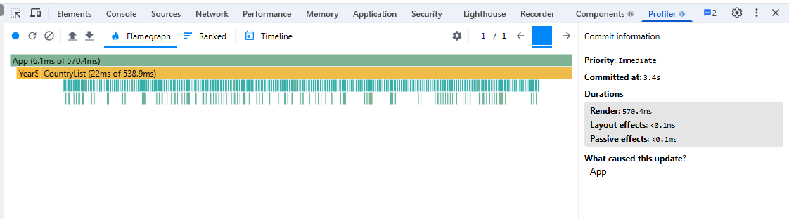
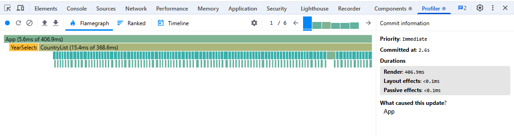
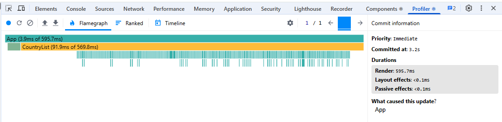
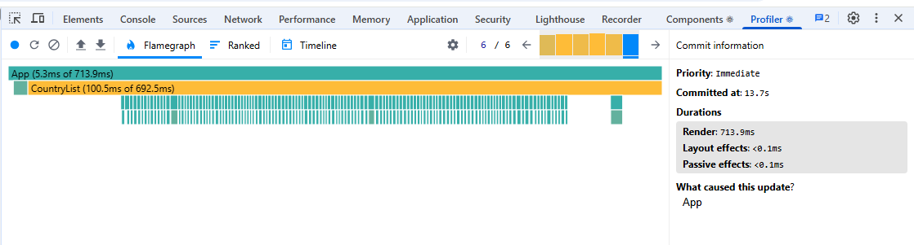
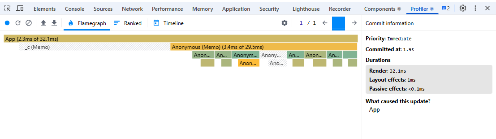
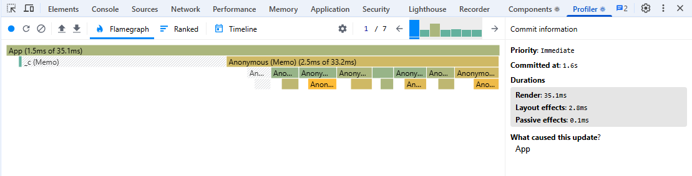
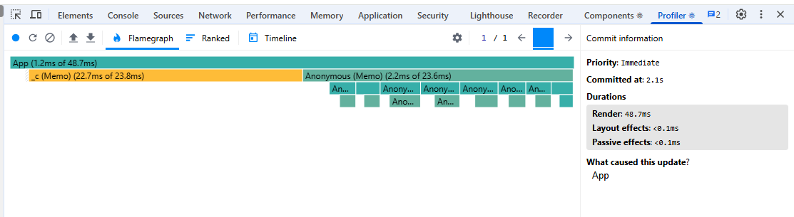
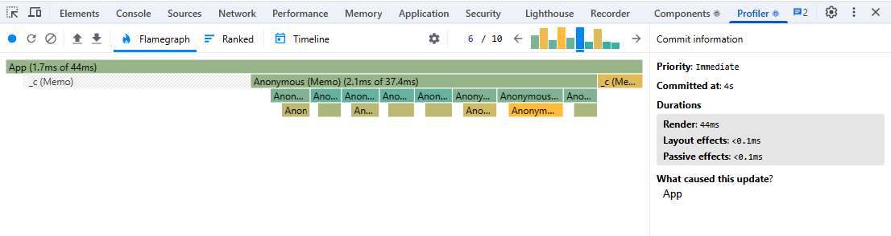

# Performance analytics before optimization

## Sorting countries:

- action: change sorting from population to name
- commits: 1
- discoveries: 
    1) every card (and dataTable inside it) rerenders because props change
    2) yearsSelector rerenders because props change, though they don't have to
- committed at: 3.4s
- render duration: 570.4ms
- flame chart: 

## Searching country:

- action: search for 'serbia'
- commits: 6 (one per letter)
- discoveries: same as in 'Sorting countries'
- longest (first) committed at: 2.6s
- longest (first) render duration: 406.9ms
- flame chart: 

## Changing year:

- action: change year from 2020 to 2022
- commits: 1
- discoveries: same as in 'Sorting countries'
- committed at: 3.2s
- render duration: 595.7ms
- flame chart: 

## Toggling columns:

- action: add 3 columns and remove one
- commits: 6
- discoveries: same as in 'Sorting countries'
- longest (4th) committed at: 9.5s
- longest (4th) render duration: 784.5ms
- flame chart: 

---

# Performance analytics after optimization

## Sorting countries:

- action: change sorting from population to name
- commits: 1
- committed at: 1.9s
- render duration: 32.1ms
- comparison: 570.4ms → 32.1ms (~17.8x faster, -94.4%)
- flame chart: 

## Searching country:

- action: search for 'serbia'
- commits: 6 (one per letter)
- longest (first) committed at: 1.6s
- longest (first) render duration: 35.1ms
- comparison: 406.9ms → 35.1ms (~11.6x faster, -91.4%)
- flame chart: 

## Changing year:

- action: change year from 2020 to 2022
- commits: 1
- committed at: 2.1s
- render duration: 48.7ms
- comparison: 595.7ms → 48.7ms (~12.2x faster, -91.8%)
- flame chart: 

## Toggling columns:

- action: add 3 columns and remove one
- commits: 10 (+4 - because of virtualisation??)
- longest (4th) committed at: 2.8s
- longest (4th) render duration: 45ms
- comparison: 784.5ms → 45ms (~17.4x faster, -94.3%)
- flame chart: 